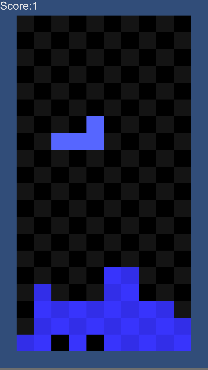

A minimalist implementation of the classic Tetris game.

1. Includes the [Super Rotation System](https://tetris.wiki/Super_Rotation_System) and [wall kick](https://tetris.wiki/Super_Rotation_System#Wall_Kicks) algorithm.

2. Game logic does not rely on GameObjects; data is stored in byte arrays.

3. The game scene is drawn using a single texture in the `OnGUI` function.

[Click here to play]("https://aillieo.github.io/TetrisGame/")
